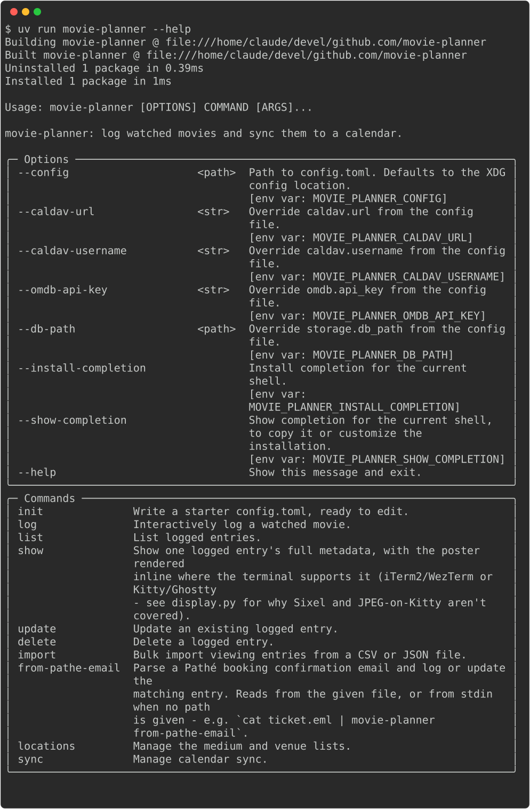

# movie-planner

[](https://github.com/alrayyes/movie-planner/actions/workflows/ci.yml)
[](https://codecov.io/gh/alrayyes/movie-planner)
[](https://github.com/alrayyes/movie-planner/releases/latest)
[](LICENSE)

A command-line tool that logs the movies you've watched — title, date,
start/end time, where you watched it — and syncs each viewing to a Baikal
(CalDAV) calendar. It replaces a hand-maintained org-mode log with a guided
prompt, enriches entries with IMDb/Rotten Tomatoes/Metacritic ratings via
OMDb, an optional TMDb-sourced trailer link, and a manually entered
Letterboxd link, and catches accidental duplicate log entries with fuzzy
title matching.

Prefer a browser to a terminal? [movie-planner-web](https://github.com/alrayyes/movie-planner-web)
is a static web client for the same CalDAV calendar and OMDb setup — no
install, no shared server, your browser talks straight to your CalDAV
server. The two tools share movie-planner's own field names, so a CSV/JSON
export from one imports straight into the other. See
[`docs/architecture.md`](docs/architecture.md) for how movie-planner,
movie-planner-web, OMDb, the calendar, and the optional
[`pathe-mail-import`](docs/pathe-mail-import.md) tool all fit together.

## Requirements

- **Python 3.14 or newer.**
- **[uv](https://docs.astral.sh/uv/)**, for the virtual environment, the
  dependencies and running everything below. Not installed by default —
  one-time setup:

  ```sh
  curl -LsSf https://astral.sh/uv/install.sh | sh
  ```

  Confirm it worked with `uv --version`.

- **[bun](https://bun.sh)**, for the tooling that isn't Python —
  commitlint, Prettier, markdownlint, and the
  [lefthook](https://lefthook.dev) that runs the git hooks. There's a
  `package.json`, but nothing here is JavaScript; it exists only so those
  tools resolve and stay pinned.
- **[Vale](https://vale.sh)**, pinned in
  [CONTRIBUTING.md](CONTRIBUTING.md#getting-set-up).
- **A Baikal (CalDAV) calendar already set up** — this tool doesn't
  provision one, only syncs to it.
- **An [OMDb API key](https://www.omdbapi.com/apikey.aspx)**, for the
  IMDb/Rotten Tomatoes/Metacritic ratings fetched on each logged entry.
- **Optional: a [TMDb API key](https://www.themoviedb.org/settings/api)**,
  for looking up each entry's official YouTube trailer alongside the OMDb
  fetch. Skipped entirely, no error, without one configured.

## Installation

See [`docs/INSTALL.md`](docs/INSTALL.md) for every install method — the
AUR, `.deb`/`.rpm` release assets, Docker, and installing from a
checkout. For development, or to run from a checkout:

```sh
git clone https://github.com/alrayyes/movie-planner.git
cd movie-planner
uv sync
```

## Usage



```sh
uv run movie-planner --help
```

(Drop `uv run` and call `movie-planner` directly if you installed it with
`pipx`/`pip` instead of running from a checkout.)

Log a viewing interactively (each field prompts if you leave it off, when
running in a terminal):

```sh
uv run movie-planner log --title "Dune" --date 2026-01-01 --medium cinema \
  --venue "Grand Vista Cinema"
```

A likely duplicate (same normalized title, same day) asks for confirmation
before adding — pass `--force` to skip that, or to add it non-interactively.

Log a Pathé cinema booking straight from its confirmation email instead —
pipe the raw email in, or point at a saved copy:

```sh
cat ticket.eml | uv run movie-planner from-pathe-email
uv run movie-planner from-pathe-email ticket.eml
```

Either way it parses the title, date, times, cinema, and booking number,
shows what it found, and asks for confirmation before writing — piping
the email doesn't skip that; the confirmation is read from the
controlling terminal, not from the piped input. A re-sent confirmation
for a booking already logged (same booking number) updates that entry
instead of creating a second one. Pass `--yes` to skip the prompt (for a
mail-pipe automation with no terminal attached) or `--no-metadata` to
skip the OMDb lookup.

Other commands:

```sh
uv run movie-planner list --from 2026-01-01 --to 2026-01-31 --medium cinema
uv run movie-planner list --chain Pathé
uv run movie-planner list --city Amsterdam
uv run movie-planner list --limit 5
uv run movie-planner list --omdb-no-match
uv run movie-planner show 3
uv run movie-planner update 3 --title "Dune Part Two"
uv run movie-planner update 3 --refresh-metadata
uv run movie-planner delete 3
uv run movie-planner locations media add cinema --physical
uv run movie-planner locations venues add "Grand Vista Cinema"
uv run movie-planner import movies.csv --force
uv run movie-planner import-failures list
uv run movie-planner import-failures clear
uv run movie-planner activity
uv run movie-planner sync retry
uv run movie-planner sync refresh
uv run movie-planner sync refresh --from 2026-01-01 --to 2026-01-31
uv run movie-planner sync refresh --date 2026-01-15
uv run movie-planner sync refresh --force --date 2026-01-15
uv run movie-planner sync pull
```

`list --limit N` shows only the N most recently dated entries, applied
after every other filter - combine it with `--chain`/`--city`/
`--medium`/`--from`/`--to` to get "the last 5 at this chain" rather
than the whole log. Omit it and `list` shows everything matching the
other filters, same as always.

`list --omdb-no-match` shows only entries whose most recent OMDb
lookup found no match - a title with a typo, a format suffix the
stripper missed, or one OMDb genuinely doesn't have - distinct from an
entry that was simply never looked up. Fix the title by hand, then
`update --refresh-metadata` (below) to try again.

`show` prints one entry's full metadata — ratings, links, venue, times,
and, where OMDb had them, director, cast, genre, and release year — in
a structured, labelled layout instead of `list`'s single line, which
shows the release year alongside the title when known. On a
terminal identifiable as iTerm2/WezTerm or Kitty/Ghostty, it also renders
the poster inline — `poster_url` is fetched and stored the same time
ratings are (`log`, `import`, `sync refresh`), or, for an entry logged
before this existed, fetched live at display time instead; anywhere
else, or with no poster available, `show` just skips the image. Kitty
only renders a poster that's already PNG — OMDb's usual JPEG posters
render on iTerm2/WezTerm only. No Sixel support.

A venue created with a name matching a hardcoded table (Pathé's own
Amsterdam cinemas, GSC's Malaysia locations, and a handful of
independent Amsterdam venues) gets its chain, city, and country filled
in automatically — a name that doesn't match gets none of that, never
a guess. `list --chain`/`--city` filter on it; `show` displays it. Most
of those same venues also carry known GPS coordinates, pushed to the
calendar as the event's `GEO` property, and most now also carry a
verified street address and postal code, extending the calendar
event's `LOCATION` from "venue, city, country" to a full address a
calendar client can geocode to the actual building (see
[`docs/calendar-schema.md`](docs/calendar-schema.md)) — again, only
ever a verified value, never estimated. This backfills onto an
existing database automatically the next time any command runs — a
venue row created before its table entry had street-level data picks
it up on the next store open, nothing to run by hand. `sync refresh`
(plain, not `--force`) is what gets the refreshed data onto the
calendar itself for entries synced before this existed, without
re-fetching OMDb ratings for entries that already have them.

`import` accepts a `.csv` or `.json` file with the same fields as
`examples/`, and fetches OMDb ratings the same as `log` does - unless a
row already supplies every OMDb-derived field itself (ratings, poster,
director, actors, genre, release year), in which case that row's OMDb
lookup is skipped entirely, same as an already-enriched entry is on
`sync refresh`. Useful for re-importing an export from somewhere that
already ran its own OMDb lookup. A row that fails to parse (a bad date,
a missing required field) is recorded rather than only echoed at the
time - `import-failures list` shows every past failure, most recent
first, and `import-failures clear` empties the list once you've dealt
with them. `sync retry`
re-pushes any entry that failed to sync when it was logged or imported —
cheap, and safe to run any time, since it never calls OMDb and only
touches entries that were never synced. `sync refresh` is the heavier
counterpart: it walks every entry, fetches OMDb data (ratings, poster,
and so on) for any entry still missing at least one such field — an
entry that already has a rating but was logged before a newer field
existed still gets that field backfilled — and re-pushes every
calendar event so its description reflects current data. Worth running
after upgrading, or to backfill data for entries imported before this
existed, not something to run reflexively the way `retry` is. Pass
`--from`/`--to` or a single `--date` to scope it to a range instead of
the whole log; `--date` can't be
combined with either. Pass `--force` to re-fetch ratings for entries
that already have them too — useful after a wrong OMDb match, or when a
rating's changed since — instead of the default of only fetching for
entries still missing one. `update --refresh-metadata` does the same
thing for one specific entry, by ID - no need to work out its date or
risk force-refreshing a sibling entry that happens to share it.

Sync is otherwise push-only — movie-planner never reads the calendar
back on its own. `sync pull` is the one exception: it fetches every
event on the calendar and compares it against the local store,
showing each new, changed, or removed entry it finds one at a time
for approval — nothing is written without an explicit yes, and
declining leaves it to be offered again next time. It's a manually
run, one-shot reconciliation, not a background job — for catching up
after using [movie-planner-web](https://github.com/alrayyes/movie-planner-web)
to create, edit, or delete an entry directly on the calendar. See
[`docs/calendar-schema.md`](docs/calendar-schema.md) for exactly which
fields it compares (only OMDb's/booking's own structured `X-*`
properties — never the free-text description).

`activity` shows a local log of every create/update/delete this tool
has made to your entries, most recent first - for an update, which
fields actually changed and their before/after values, not the whole
entry. It's populated automatically by `log`, `update`, `delete`,
`import`, `from-pathe-email`, and `sync refresh`/`sync pull`, since
they all go through the same three store operations underneath. Local
to this tool only - it's not a shared trail with
[movie-planner-web](https://github.com/alrayyes/movie-planner-web),
which keeps its own equivalent log of the actions it makes.

A large historical import (years of entries at once) can exceed OMDb's
daily request limit before it finishes. Pass `--no-metadata` to `import`
to create every entry with no OMDb calls at all, then backfill ratings
afterward with `sync refresh --from`/`--to`, one date range per day, as
many days as the limit takes to clear:

```sh
uv run movie-planner import movies-2020-2026.csv --no-metadata
uv run movie-planner sync refresh --from 2020-01-01 --to 2021-12-31
# next day:
uv run movie-planner sync refresh --from 2022-01-01 --to 2023-12-31
# ...and so on until every year is covered
```

Sync is push-only — the local SQLite store is the only source of
truth, and nothing here ever reads the calendar back. See
[`docs/calendar-schema.md`](docs/calendar-schema.md) for exactly what
gets written to the calendar, if something else needs to read it.

## Configuration

A TOML file at `$XDG_CONFIG_HOME/movie-planner/config.toml`
(`~/.config/movie-planner/config.toml` if `XDG_CONFIG_HOME` isn't set):

```toml
[movie_planner.caldav]
url = "https://baikal.example.com/dav.php/calendars/moviewatcher/movies/"
username = "moviewatcher"
password = "..."

[movie_planner.omdb]
api_key = "..."

# Optional - trailer lookups are simply skipped without it:
# [movie_planner.tmdb]
# api_key = "..."

[movie_planner.storage]
db_path = "~/.local/share/movie-planner/movies.db"
```

Run `movie-planner init` to write this file — it prompts for the CalDAV
URL, CalDAV username, and OMDb API key (skipping the prompt for any of
the three already given as a flag or environment variable), then
leaves the CalDAV password for you to fill in by hand afterward. Run
without a terminal to prompt against and a required value is missing,
it fails with a clear message instead of hanging — pass the value
explicitly instead. Any other command run against a missing config
file offers to write a bare placeholder copy instead, to edit by hand.
`[caldav]`/`[omdb]`/`[storage]` are required; a missing file or a
missing key in one of those three fails with a message naming the
problem, not a stack trace. `[tmdb]` is the one optional section — add
it (by hand, `init` doesn't prompt for it) whenever you want trailer
lookups; nothing else is affected by leaving it out.

The `[movie_planner]` table is there so this file can be shared with
[pathe-mail-import](docs/pathe-mail-import.md), which keeps its own
settings under `[mail_import]` in the same file — point both tools'
`--config` (or `$XDG_CONFIG_HOME/*/config.toml`) at one path, and
`movie-planner init`/`pathe-mail-import init` each add their own
section without disturbing the other's. An older config file with
`[caldav]`/`[omdb]`/`[storage]` at the top level (no `[movie_planner]`
wrapper) still loads exactly as before — nothing to migrate for an
existing setup.

The `[movie_planner]` table is there so this file can be shared with
[pathe-mail-import](docs/pathe-mail-import.md), which keeps its own
settings under `[mail_import]` in the same file — point both tools'
`--config` (or `$XDG_CONFIG_HOME/*/config.toml`) at one path, and
`movie-planner init`/`pathe-mail-import init` each add their own
section without disturbing the other's. An older config file with
`[caldav]`/`[omdb]`/`[storage]` at the top level (no `[movie_planner]`
wrapper) still loads exactly as before — nothing to migrate for an
existing setup.

Instead of `caldav.password` in plain text, `caldav.password_command` runs
a command and uses its stdout as the password — a password manager CLI, for
example. Set only one of the two.

Every setting except the CalDAV password can also be set as a flag
(`--caldav-url`, `--caldav-username`, `--omdb-api-key`, `--tmdb-api-key`,
`--db-path`) or an environment variable (`MOVIE_PLANNER_CALDAV_URL` and so
on), overriding the
config file for one invocation — flags win over environment variables, which
win over the config file. The password stays config-file-only (via
`password` or `password_command`) rather than risk landing in shell history
or a process list.

### Diagnosing a problem with `--verbose`

`--verbose` (or `$MOVIE_PLANNER_VERBOSE`) works on every command and prints
diagnostic detail to stderr as it runs: the exact OMDb/TMDb request made,
the full calendar payload a push sends, and why a duplicate was or wasn't
detected. Normal output is unchanged either way — this only adds detail
alongside it, so it's safe to leave on while tracking down a problem:

```console
$ movie-planner --verbose log --title "Dune" --date 2026-01-01 --medium cinema
no duplicate found for 'Dune' on 2026-01-01
OMDb request: {'t': 'Dune', 'type': 'movie'}
OMDb response: Dune matched imdb_id=tt1160419
Calendar push (create, uid=...):
BEGIN:VCALENDAR
...
Logged 'Dune' and synced it to the calendar.
```

## Import examples

[`examples/`](examples/) has three fictional viewings in CSV and JSON
form, plus a [JSON Schema](examples/movies.schema.json) for the row shape
both formats share.

## Importing Pathé booking confirmations in bulk

[`pathe-mail-import`](docs/pathe-mail-import.md) is a separate tool
(installed alongside `movie-planner` from this same checkout) that
reads an IMAP mailbox or a local mbox file, finds Pathé booking
confirmations, and emits a JSON file this `import` command accepts -
`movie-planner` itself never has to know what Pathé's emails look
like, or what IMAP is.

## Contributing

See [CONTRIBUTING.md](CONTRIBUTING.md) for the toolchain, the hooks, and
how a change gets reviewed and released.

## Licence

[GPL-3.0](LICENSE).
