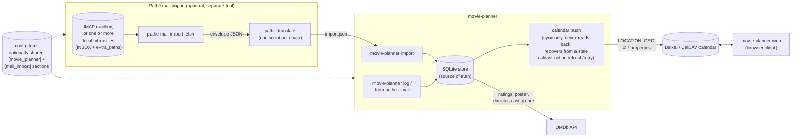

# Architecture

How movie-planner, its companion tools, and the services around them
fit together - not implementation detail, just what talks to what and
why.

## What each piece actually knows about

- **movie-planner** (this repo's main CLI) owns the SQLite store - the
  only source of truth, per [`docs/calendar-schema.md`](calendar-schema.md).
  It reads from a CSV/JSON file or stdin (`import`), a piped or given
  email (`from-pathe-email`), or interactive prompts (`log`) - and
  pushes to the calendar. It never reads the calendar back, and it has
  no idea `pathe-mail-import` or `movie-planner-web` exist.
- **pathe-mail-import** ([its own doc page](pathe-mail-import.md)) is
  entirely separate - a different binary, no shared code path with
  `movie-planner`'s own CLI. Its only contact with `movie-planner` is
  the `import.json` shape both sides agree on
  ([`examples/movies.schema.json`](../examples/movies.schema.json)).
  It never touches the store or the calendar. It can optionally scan
  more than one local mbox file in one `fetch` (`mail.mbox.path` plus
  `extra_paths`, for example a `Archive` folder a mail client moved
  older messages into), merging and deduplicating the results.
- **Configuration** for both tools can live in one file or two - each
  writes into its own namespaced section (`[movie_planner]`,
  `[mail_import]`) via a shared, merge-safe read-modify-write, so
  pointing both `init` commands at the same path doesn't clobber the
  other tool's settings. An older config file with no namespaced
  wrapper, for either tool, still loads exactly as before.
- **OMDb** enriches entries with ratings, poster, director, cast,
  genre, and release year - fetched by `movie-planner` itself
  (`log`, `import`, `sync refresh`, `from-pathe-email`), never by the
  mail-import tool.
- **The CalDAV calendar** (Baikal or otherwise) is a synced mirror,
  written to but never read from by `movie-planner`.
  **movie-planner-web** (a separate repo) is the other thing that
  talks to it directly - a browser client reading and writing the same
  calendar, independent of whether entries got there via `log`,
  `import`, or `pathe-mail-import`'s output.

## Why this shape

Each arrow is a real, narrow contract, not a shared library or a
subcommand relationship. `pathe-mail-import` could be replaced with a
handwritten `import.json` and nothing else in the picture would
notice; `movie-planner-web` could be replaced with a different CalDAV
client and nothing on the CLI side would notice either. The one thing
every piece agrees on is the two file/calendar shapes
(`movies.schema.json` and [the calendar's own VEVENT
fields](calendar-schema.md)) - not each other's internals.

## Known gaps and open design questions

For anyone (human or agent) picking this project up mid-thread:

- **Venue identity** (issue #196): fixed in code - `add_venue`/
  `get_or_create_venue` now resolve a known screen/format-suffixed
  alias ("De Munt 4DX") to its canonical venue ("De Munt") before
  ever creating a row, via `KNOWN_VENUE_LOCATIONS`'s new
  `canonical_name`. A database with venue rows already split before
  this landed (Ryan's real one included) still needs the one-time
  `locations venues merge-aliases` migration run against it (dry-run
  by default) and a `sync refresh --force` afterward to fix any
  already-pushed calendar `LOCATION` values - not yet run against the
  real data as of this note.
- **`sync` can't tell "the calendar was rebuilt" from "an entry never
  synced"** the cheap way: `sync retry` only ever looks at entries with
  no `caldav_uid` at all, so it can't recover one whose `caldav_uid`
  points at an event a wiped/rebuilt calendar no longer has - only the
  heavier `sync refresh` (via `push_update`'s own not-found recovery,
  issue #166) does. Current read: this is `retry`'s documented
  contract working as intended, not a bug - reopen the question if
  that stops feeling right in practice.
- **`movie-planner log` sometimes doesn't add the new entry to the
  calendar** (issue #167) - reported live, root cause not yet
  confirmed from this sandbox; needs the exact command, full output,
  and whether a `Warning:` line appeared.
- **"`list` also shows cached shows"** (issue #168) - reported live,
  needs clarification on which command and what "cached" refers to
  before it's actionable.
- **Whether the calendar should become the actual source of truth**,
  instead of the local SQLite store (issue #169) - a deliberate
  reversal of the "Why this shape" reasoning above, not something to
  decide from a bug report. Explore-mode territory, not a ticket to
  just implement.
- **One real historical Pathé template (2012, `pathe.nl`) has no movie
  title anywhere** - not in the Subject, not in either MIME part, only
  an Unlimited-pass number and a poster image's numeric `movieid`
  parameter (issue #200). Confirmed against the original unredacted
  email, not just the redacted fixture. Deliberately left unparsed
  rather than forcing a parser with no title to extract - a booking
  from this era can't be logged via `pathe-mail-import` at all.
