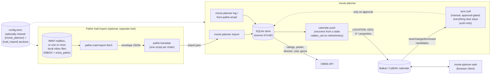

# Architecture

How movie-planner, its companion tools, and the services around them
fit together - not implementation detail, just what talks to what and
why.

## What each piece actually knows about

- **movie-planner** (this repo's main CLI) owns the SQLite store - the
  only source of truth, per [`docs/calendar-schema.md`](calendar-schema.md).
  It reads from a bulk-import file or stdin (`import` - CSV and JSON
  today, and a registry a new format plugs into without touching
  `cli.py`; see CONTRIBUTING.md's "Adding a new import format"), a
  piped or given email (`from-pathe-email`), or interactive prompts
  (`log`) - and
  pushes to the calendar. `log`/`import`/`update`/`sync refresh`/
  `sync retry` never read the calendar back; `sync pull` (issue #235)
  is the one, manually run exception - it reconciles calendar-side
  changes back into the store, one approval-gated candidate at a
  time, never automatically. It has no idea `pathe-mail-import` or
  `movie-planner-web` exist.
- **pathe-mail-import** ([its own doc page](pathe-mail-import.md)) is
  entirely separate - a different binary, no shared code path with
  `movie-planner`'s own CLI. Its only contact with `movie-planner` is
  the `import.json` shape both sides agree on
  ([`examples/movies.schema.json`](../examples/movies.schema.json)).
  It never touches the store or the calendar. It can optionally scan
  more than one local mbox file in one `fetch` (`mail.mbox.path` plus
  `extra_paths`, for example a `Archive` folder a mail client moved
  older messages into), merging and deduplicating the results.
- **Configuration** for both tools can live in one file or two - each
  writes into its own namespaced section (`[movie_planner]`,
  `[mail_import]`) via a shared, merge-safe read-modify-write, so
  pointing both `init` commands at the same path doesn't clobber the
  other tool's settings. An older config file with no namespaced
  wrapper, for either tool, still loads exactly as before.
- **OMDb** enriches entries with ratings, poster, director, cast,
  genre, and release year - fetched by `movie-planner` itself
  (`log`, `import`, `sync refresh`, `from-pathe-email`), never by the
  mail-import tool.
- **The CalDAV calendar** (Baikal or otherwise) is a synced mirror,
  written to by every `movie-planner` command except `sync pull`,
  which is the only one that also reads it back (approval-gated, see
  above). **movie-planner-web** (a separate repo) is the other thing
  that talks to it directly - a browser client reading and writing the
  same calendar, independent of whether entries got there via `log`,
  `import`, or `pathe-mail-import`'s output.

## Why this shape

Each arrow is a real, narrow contract, not a shared library or a
subcommand relationship. `pathe-mail-import` could be replaced with a
handwritten `import.json` and nothing else in the picture would
notice; `movie-planner-web` could be replaced with a different CalDAV
client and nothing on the CLI side would notice either. The one thing
every piece agrees on is the two file/calendar shapes
(`movies.schema.json` and [the calendar's own VEVENT
fields](calendar-schema.md)) - not each other's internals.

## Known gaps and open design questions

For anyone (human or agent) picking this project up mid-thread:

- **Venue identity** (issue #196): fixed in code - `add_venue`/
  `get_or_create_venue` now resolve a known screen/format-suffixed
  alias ("De Munt 4DX") to its canonical venue ("De Munt") before
  ever creating a row, via `KNOWN_VENUE_LOCATIONS`'s new
  `canonical_name`. A database with venue rows already split before
  this landed (Ryan's real one included) still needs the one-time
  `locations venues merge-aliases` migration run against it (dry-run
  by default) and a `sync refresh --force` afterward to fix any
  already-pushed calendar `LOCATION` values - not yet run against the
  real data as of this note.
- **`sync` can't tell "the calendar was rebuilt" from "an entry never
  synced"** the cheap way: `sync retry` only ever looks at entries with
  no `caldav_uid` at all, so it can't recover one whose `caldav_uid`
  points at an event a wiped/rebuilt calendar no longer has - only the
  heavier `sync refresh` (via `push_update`'s own not-found recovery,
  issue #166) does. Current read: this is `retry`'s documented
  contract working as intended, not a bug - reopen the question if
  that stops feeling right in practice.
- **`push_new` records `caldav_uid` locally before creating the
  calendar event, not after** (issue #246) - a killed process or
  dropped connection between the two used to leave the local entry
  with no `caldav_uid` at all while a real, orphaned event sat on the
  calendar with no local row pointing at it; the next retry couldn't
  tell it had already been created and made a genuine duplicate.
  Reordering the write means the local record and the calendar event
  (whether or not it exists yet) always agree on the UID, so any later
  push for that entry recovers through the same not-found path
  described in the preceding bullet rather than creating a second
  event. This narrows `sync retry`'s already-narrow scope further: a
  `push_new` failure now leaves a `caldav_uid` too, even a normal
  caught one, not just a crash, so `sync retry` only still helps an
  entry that's never even attempted a push at all - `sync refresh` is
  the correct retry for anything that has.
- **"`list` also shows cached shows"** (issue #168) - reported live;
  Ryan later clarified "shows" probably means cached showings, that
  is, viewings/entries, not TV series - but two things are still
  unclear: what "cached" refers to (stale OMDb data, an orphaned local
  entry, something else) and which command surfaces it, so this isn't
  actionable yet.
- **One real historical Pathé template (2012, `pathe.nl`) has no movie
  title anywhere** - not in the Subject, not in either MIME part, only
  an Unlimited-pass number and a poster image's numeric `movieid`
  parameter (issue #200). Confirmed against the original unredacted
  email, not just the redacted fixture. Deliberately left unparsed
  rather than forcing a parser with no title to extract - a booking
  from this era can't be logged via `pathe-mail-import` at all.
