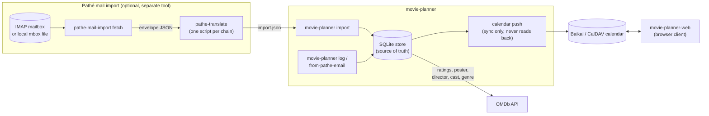

# Architecture

How movie-planner, its companion tools, and the services around them
fit together - not implementation detail, just what talks to what and
why.

## What each piece actually knows about

- **movie-planner** (this repo's main CLI) owns the SQLite store - the
  only source of truth, per [`docs/calendar-schema.md`](calendar-schema.md).
  It reads from a CSV/JSON file or stdin (`import`), a piped or given
  email (`from-pathe-email`), or interactive prompts (`log`) - and
  pushes to the calendar. It never reads the calendar back, and it has
  no idea `pathe-mail-import` or `movie-planner-web` exist.
- **pathe-mail-import** ([its own doc page](pathe-mail-import.md)) is
  entirely separate - a different binary, a different config file, no
  shared code path with `movie-planner`'s own CLI. Its only contact
  with `movie-planner` is the `import.json` shape both sides agree on
  ([`examples/movies.schema.json`](../examples/movies.schema.json)).
  It never touches the store or the calendar.
- **OMDb** enriches entries with ratings, poster, director, cast,
  genre, and release year - fetched by `movie-planner` itself
  (`log`, `import`, `sync refresh`, `from-pathe-email`), never by the
  mail-import tool.
- **The CalDAV calendar** (Baikal or otherwise) is a synced mirror,
  written to but never read from by `movie-planner`.
  **movie-planner-web** (a separate repo) is the other thing that
  talks to it directly - a browser client reading and writing the same
  calendar, independent of whether entries got there via `log`,
  `import`, or `pathe-mail-import`'s output.

## Why this shape

Each arrow is a real, narrow contract, not a shared library or a
subcommand relationship. `pathe-mail-import` could be replaced with a
handwritten `import.json` and nothing else in the picture would
notice; `movie-planner-web` could be replaced with a different CalDAV
client and nothing on the CLI side would notice either. The one thing
every piece agrees on is the two file/calendar shapes
(`movies.schema.json` and [the calendar's own VEVENT
fields](calendar-schema.md)) - not each other's internals.
