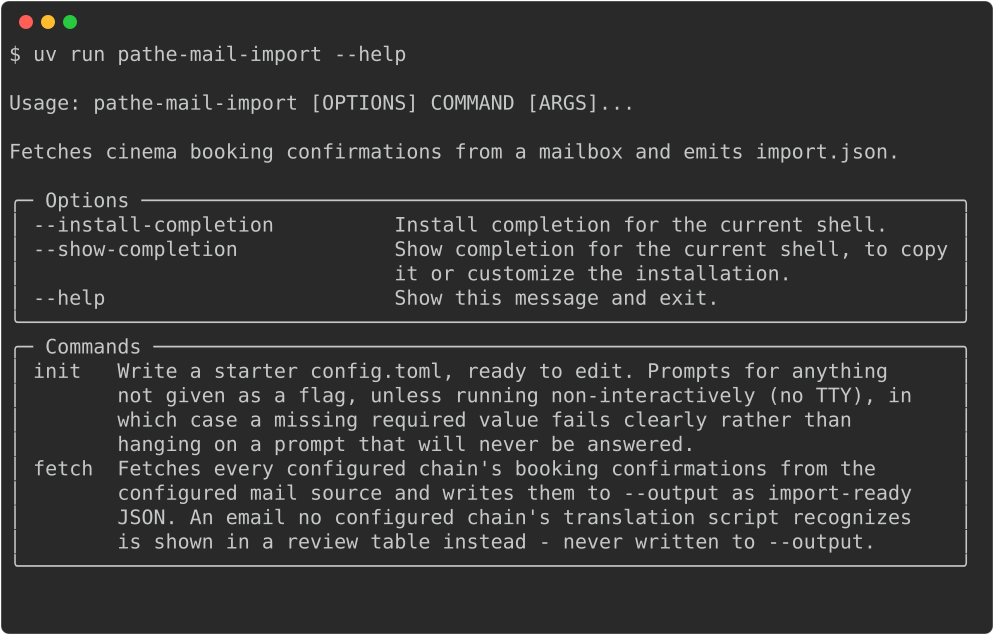

# pathe-mail-import

A standalone tool that reads a mailbox (IMAP, or a local mbox file),
finds cinema booking confirmations, and turns them into a JSON file
`movie-planner import` accepts - entirely separate from `movie-planner`
itself. Neither knows the other exists: `movie-planner --help` never
mentions Pathé or IMAP, and this tool never touches the store or the
CalDAV calendar. See [`README.md`](../README.md) for `movie-planner`
itself.



## Requirements

- The same [uv](https://docs.astral.sh/uv/)-managed checkout
  `movie-planner` itself uses - there's no separate install; both
  tools come from `uv sync` in this repo.
- An IMAP mailbox (a local [Proton Mail
  Bridge](https://proton.me/mail/bridge) instance, or a Gmail account
  with an app password), or a local mbox-format file (mutt's own
  storage, or Thunderbird's default local-folder format, which is also
  plain mbox).
- One translation script per cinema chain you want recognized -
  `pathe-translate` (also installed by `uv sync`) covers Pathé.

## Installation

From a checkout, same as `movie-planner`:

```sh
git clone https://github.com/alrayyes/movie-planner.git
cd movie-planner
uv sync
```

This installs three commands into the project's `.venv`:
`pathe-mail-import` (this tool), `pathe-translate` (Pathé's own
translation script), and `movie-planner` itself.

**Not currently packaged the way `movie-planner` is** - no AUR
package, no `.deb`/`.rpm`, no published Docker image. It _can_ be
built as its own container image from this same checkout
(`docker build --target pathe-mail-import -t pathe-mail-import .`,
sharing the base image and dependency layers `movie-planner`'s own
image build already has), but that image isn't published to a
registry anywhere yet - building it yourself is the only way to get
it as a container today.

Man pages exist too (`pathe-mail-import.1`, `pathe-mail-import-init.1`,
`pathe-mail-import-fetch.1`), generated the same way `movie-planner`'s
own are - `./scripts/generate-man.sh` writes them to `man/` from a
checkout. They aren't installed anywhere automatically without a
package, same caveat as the preceding paragraph.

## Configuration

A TOML file at `$XDG_CONFIG_HOME/pathe-mail-import/config.toml`
(`~/.config/pathe-mail-import/config.toml` if `XDG_CONFIG_HOME` isn't
set) - entirely separate from `movie-planner`'s own `config.toml`.

```toml
[mail]
source = "imap"          # or "mbox"

[mail.imap]
host = "127.0.0.1"
port = 1143
username = "you@example.com"
password = "..."
# Or, instead of a plaintext password above, run a command that prints
# it to stdout (e.g. a password manager) - set only one of the two:
# password_command = "pass show imap/pathe-mail-import"

# [mail.mbox]
# path = "~/Mail/INBOX"

[[chains]]
sender_domain = "pathe.nl"
translate = "pathe-translate"
```

Run `pathe-mail-import init` to write a starter copy interactively -
it prompts for anything not given as a flag, or fails clearly (rather
than hanging) if it isn't running in a terminal and a required value
is missing. The IMAP password is never accepted as a flag, only a
masked interactive prompt or `--imap-password-command` - the same
shell-history/process-list concern `movie-planner`'s own CalDAV
password already avoids the same way.

```sh
pathe-mail-import init --source imap --imap-host 127.0.0.1 \
  --imap-port 1143 --imap-username you@example.com
```

## Usage

Fetch everything a configured chain recognizes and write it to a file:

```sh
pathe-mail-import fetch --output import.json
movie-planner import import.json
```

Any email a configured chain's sender domain matches, but its
translation script doesn't recognize, is never written to
`--output` - it's printed as a review table instead:

```text
Wrote 3 row(s) to import.json.

1 email(s) not recognized by any configured chain:
From                          Subject                Date
Pathé Nederland <noreply@...> Your weekly newsletter  2026-07-05
```

`--since`/`--until` scope a run to a date range, for a cron job that
only wants to re-check its own window each time rather than the whole
mailbox - the tool itself keeps no state between runs, so the caller
computing that window is what makes a scoped run possible:

```sh
pathe-mail-import fetch --output import.json --since "1 hour ago"
```

### Composing it by hand instead

`fetch --envelopes-only` and `movie-planner import`'s own stdin
support mean the whole thing can be a real shell pipe instead of two
commands and a temp file:

```sh
pathe-mail-import fetch --envelopes-only \
  | pathe-translate \
  | movie-planner import
```

An email a chain matches but the script doesn't recognize gets a
diagnostic on stderr in this mode (visible directly in the terminal,
since a pipe never reaches stderr) rather than a review table - there's
no coordinating process left to build one.

## Adding a second cinema chain

Nothing in `pathe-mail-import` itself knows about Pathé - `[[chains]]`
just maps a sender domain to an external command. A new chain is a new
translation script plus a new `[[chains]]` entry, no changes to this
tool's own code:

- **Input**: one JSON envelope per line on stdin - `{"from": "...",
"subject": "...", "date": "...", "body": "..."}`.
- **Output**: for a recognized email, one
  [`movies.schema.json`](../examples/movies.schema.json)-shaped JSON
  row on stdout (`source` is overwritten by `pathe-mail-import` itself
  with the matched sender domain, so the script doesn't need to set
  it). For anything it doesn't recognize: nothing on stdout, a
  diagnostic on stderr, and (when it's the last line read) a non-zero
  exit.
- Any language - the contract is stdin/stdout/exit code, not a Python
  API. `pathe-translate` (this repo's own
  [`src/movie_planner/mail_import/pathe_translate.py`](../src/movie_planner/mail_import/pathe_translate.py))
  is a small, readable reference implementation wrapping
  `movie_planner.pathe.parse_pathe_email`.

## Contributing and licence

Same repository, same [`CONTRIBUTING.md`](../CONTRIBUTING.md) and
[licence](../LICENSE) as `movie-planner` itself.
